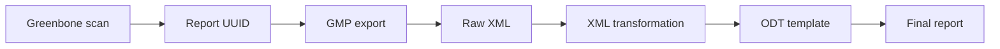

# Report pipeline

End-to-end report generation workflow from Greenbone scan to final ODT document.

## Pipeline stages



## Stage 1 — Report UUID

After a scan completes, obtain the report UUID from the GSA web interface or via GMP:

```bash
gvm-cli --gmp-username admin --gmp-password <PASSWORD> socket \
  --xml "<get_tasks/>" | grep -oP 'report_id="\K[^"]+'
```

## Stage 2 — GMP export

Export the raw XML report:

```bash
gvm-cli --gmp-username admin --gmp-password <PASSWORD> socket \
  --xml "<get_reports report_id='<REPORT_ID>' format_id='a994b278-1f62-11e1-96ac-406186ea4fc5'/>" \
  > reports/export/<report-name>.xml
```

Format IDs (discover from active system):
- `a994b278-1f62-11e1-96ac-406186ea4fc5` — XML
- `c402cc3e-b531-11e1-9163-406186ea4fc5` — CSV (Host Details)
- `9c5e17de-9b56-4c73-a4d6-8620e430e7a8` — CSV (Results)
- `6c248931-8f56-4f7a-b6db-d10b9d7310da` — PDF

## Stage 3 — Raw XML validation

```bash
xmllint --noout reports/export/<report-name>.xml
sha256sum reports/export/<report-name>.xml > reports/export/<report-name>.sha256
```

## Stage 4 — XML transformation

Python scripts in `reports/transform/`:
- Parse raw XML with safe parser (XXE protection enabled)
- Extract: host list, port/protocol, CVEs, severities, descriptions
- Normalize to intermediate structured data
- Checksum and provenance tracking

See individual scripts in `reports/transform/` for details.

## Stage 5 — ODT template

ODT templates are stored in `reports/templates/`. Each template is an OpenDocument
file with placeholders for vulnerability data.

Template requirements:
- LibreOffice-compatible ODT format
- Placeholders using a consistent syntax
- No hardcoded vulnerability data

## Stage 6 — Report generation

```bash
# Example generation command (pipeline script TBD)
python3 reports/transform/generate_report.py \
  --input reports/export/<report-name>.xml \
  --template reports/templates/default.odt \
  --output reports/output/<report-name>.odt
```

## Data safety

- XML exports contain full vulnerability evidence — treat as sensitive.
- ODT output files contain target IPs, ports, vulnerabilities — handle accordingly.
- Never commit raw XML or generated ODT files to the repository.
- Always checksum source XML before transformation.
